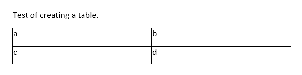

###### Sample1 is to implement the following article in F#.
https://technet.microsoft.com/en-us/events/documentformat.openxml.openxmlelement

###### Sample2 is to write a text, and create a simple table as follows.

